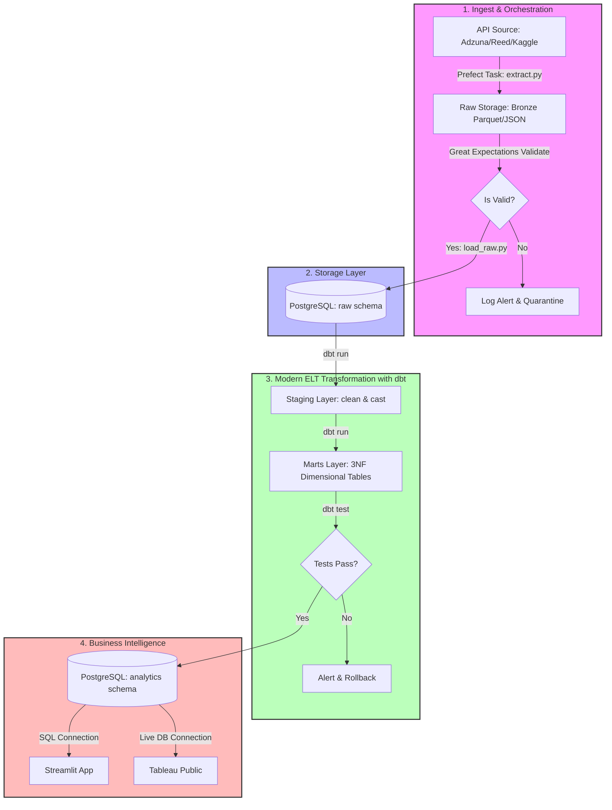

# LaborMarket-ETL Pipeline: Advanced Modern Data Stack (MDS) Implementation Plan

This document outlines the step-by-step architecture and implementation details for building an enterprise-grade **LaborMarket-ELT (Extract-Load-Transform) Pipeline**. This plan upgrades the basic local ETL pipeline to a production-ready, orchestrator-driven Modern Data Stack, introducing robust validation, modular SQL modeling, and containerized analytics.

---

## 1. Upgrade Justification: Traditional ETL vs. Modern ELT

The original architecture relied on a traditional **ETL** process (Extract, Python Pandas Transform, MySQL Load). Here is why the upgraded **ELT** architecture is superior:

| Feature | Original ETL (MySQL + Pandas) | Upgraded ELT (Postgres + dbt + Prefect) |
| :--- | :--- | :--- |
| **Pipeline Paradigm** | **ETL**: Transformations happen in Pandas memory before loading. Ingestion failure or schema drift crashes the load. | **ELT**: Ingestion loads raw data immediately (Bronze). Transformations happen in the database (Silver/Gold) using SQL. |
| **Database Engine** | **MySQL (OLTP)**: Row-oriented database designed for transactional applications; slower for analytical aggregations. | **Postgres / DuckDB (OLAP-friendly)**: Excellent analytical query speeds, native JSON support, and full integration with dbt. |
| **Transformation Layer** | Hardcoded **Pandas** python code. Tightly coupled, difficult to debug, lacks schema testing and data lineage. | **dbt (Data Build Tool)**: Standardized SQL modeling with built-in version control, automatic documentation, and auto-generated data lineage. |
| **Orchestration** | Custom `main.py` script. No visual DAG, no automatic retries, no state tracking, and no monitoring UI. | **Prefect**: Elegant code-based orchestration, job scheduling, custom retries, slack notifications, and local monitoring UI dashboard. |
| **Data Quality** | Implicit handling (script crashes on error). | **Great Expectations & dbt tests**: Explicit schema assertions, nullity checks, and value validation before and after loading. |
| **BI & Analytics** | Tableau Desktop (Manual GUI configuration, hard to version control). | **Dual Analytics (Streamlit + Tableau)**: Streamlit for Python-based, version-controlled app dashboards; Tableau for enterprise reporting. |

---

## 2. System Architecture

The pipeline leverages Docker containers to organize ingestion, orchestration, storage, transformation, and visualization.



---

## 3. Directory Structure

This structure separates concerns by isolating raw Python ingestion tasks, dbt transformation SQL models, orchestrator settings, and dashboard code.

```text
labormarket-elt/
├── .github/
│   └── workflows/
│       └── run_pipeline.yml     # CI/CD action to test and trigger pipeline
├── config/
│   └── database.ini             # DB connection profile (loaded dynamically)
├── data/
│   ├── raw/                     # Landing zone for raw ingestion files (Bronze)
│   └── validation/              # Great Expectations validation suites & outputs
├── dbt_project/                 # dbt (Data Build Tool) configuration directory
│   ├── dbt_project.yml          # Core dbt project settings
│   ├── profiles.yml             # DB connection configurations for dbt
│   └── models/
│       ├── staging/             # Silver Layer: Type casting & column renaming
│       │   ├── schema.yml
│       │   ├── stg_jobs.sql
│       │   └── stg_companies.sql
│       └── marts/               # Gold Layer: Normalized dimensional models (3NF)
│           ├── schema.yml
│           ├── fct_jobs.sql
│           ├── dim_companies.sql
│           ├── dim_locations.sql
│           └── dim_skills.sql
├── db/
│   └── init_raw.sql             # SQL to initialize the raw landing schemas
├── src/
│   ├── __init__.py
│   ├── extract.py               # Extract module (API fetching, rate limiting, and paging)
│   ├── load_raw.py              # Loads raw CSV/Parquet into Postgres staging using COPY
│   ├── parser.py                # NLP skill extractor (spaCy taxonomy/regex parser)
│   ├── validation.py            # Great Expectations validation check scripts
│   └── dashboard.py             # Streamlit interactive BI application
├── docker-compose.yml           # Runs Postgres, Prefect Server, and Streamlit
├── Dockerfile                   # Python ETL container with dbt & required drivers
├── requirements.txt             # Project library dependencies
└── main.py                      # Main entrypoint running the Prefect flow DAG
```

---

## 4. Upgraded Database Design (PostgreSQL / Dimensional 3NF)

Rather than storing a flat, messy dataset, we load into normalized tables inside the target schema. To optimize analytics for tools like Tableau, we construct dimensional modeling views (Fact and Dimension tables).

```mermaid
erDiagram
    fct_jobs }|--|| dim_companies : "hired by"
    fct_jobs }|--|| dim_locations : "located in"
    fct_jobs ||--o{ bridge_job_skills : "demands"
    dim_skills ||--o{ bridge_job_skills : "referenced by"

    dim_companies {
        int company_key PK
        string company_name UNIQUE
        string industry
        string size_range
    }

    dim_locations {
        int location_key PK
        string city
        string state
        string country
        string zipcode
    }

    dim_skills {
        int skill_key PK
        string skill_name UNIQUE
        string skill_category "Language/Cloud/Framework"
    }

    fct_jobs {
        int job_key PK
        string job_title
        int company_key FK
        int location_key FK
        date posted_date
        decimal salary_min
        decimal salary_max
        decimal salary_midpoint
        string currency
        string work_type "Remote/Hybrid/Onsite"
    }

    bridge_job_skills {
        int job_key FK
        int skill_key FK
    }
```

---

## 5. Implementation Phases

### Phase 1: Local Infrastructure Setup
1. **Docker Compose**: Containerize a **PostgreSQL** database (specifically configured for high-write loads) and a local **Prefect Server** instance.
2. **Raw Schema Setup (`db/init_raw.sql`)**: Prepare the target raw schema where raw data will be stored before transformation.

### Phase 2: Ingest & Validate (Extract)
1. **Extraction (`src/extract.py`)**: Fetch real job postings from API endpoints (e.g., Adzuna, Reed, or GitHub jobs archive) using retry mechanisms and rate limiting. Save as timestamped Parquet files in `data/raw/`.
2. **Data Validation (`src/validation.py`)**: Run a **Great Expectations** script against raw files to confirm basic metrics (e.g., non-null title, valid ISO dates, expected columns exist) before loading.

### Phase 3: Raw Load (Load)
1. **Loading Raw (`src/load_raw.py`)**: Use Python with SQLAlchemy and `psycopg2` `copy_expert` for lightning-fast bulk ingestion into the raw landing schema (`raw.raw_jobs`).

### Phase 4: Transformation & Schema Normalization (Transform)
1. **dbt Staging Models**: Clean column names, cast types, and standardized currency exchange rates.
2. **NLP Skill Extraction & Imputation (`src/parser.py`)**:
   - Extract raw text descriptions, parse skills using a **spaCy** custom pipeline, and output skills to a JSON column.
   - For missing salaries, run a fallback imputation inside SQL: compute the median salary grouping by job title and location, updating nulls.
3. **dbt Marts Models**: Break down the clean data into the 3NF dimensional tables (`dim_companies`, `dim_locations`, `dim_skills`, `fct_jobs`, and `bridge_job_skills`).
4. **dbt Testing**: Write data assertions in dbt `schema.yml` configurations to test integrity (e.g., unique constraints on keys, foreign key matches, non-null values).

### Phase 5: Dashboard and BI Development
1. **Streamlit App (`src/dashboard.py`)**: Build a dashboard plotting salary metrics, skill densities, and job geography using Plotly and Python.
2. **Tableau Public integration**: Expose a database view `analytics.v_salary_distribution` for Tableau connection.

---

## 6. Key Upgraded Code Snippets

### A. Advanced Ingestion & Orchestration with Prefect (`main.py`)
This script defines a task graph with automatic retries, caching, and clean execution steps.

```python
import os
from prefect import task, flow
from src.extract import fetch_api_data
from src.validation import validate_raw_files
from src.load_raw import bulk_insert_raw
from src.parser import run_nlp_enrichment

@task(retries=3, retry_delay_seconds=30)
def extract_jobs_task():
    raw_file_path = fetch_api_data()
    return raw_file_path

@task
def validate_data_task(file_path: str):
    is_valid = validate_raw_files(file_path)
    if not is_valid:
        raise ValueError("Data validation failed: Raw schema does not match standards.")
    return file_path

@task
def load_raw_task(file_path: str):
    bulk_insert_raw(file_path)

@task
def run_dbt_models_task():
    # Run dbt using shell commands
    exit_code = os.system("dbt run --project-dir ./dbt_project")
    if exit_code != 0:
        raise RuntimeError("dbt compilation or execution failed.")
        
    test_code = os.system("dbt test --project-dir ./dbt_project")
    if test_code != 0:
        raise RuntimeError("dbt tests failed.")

@flow(name="Labor-Market-ELT-Pipeline")
def run_elt_pipeline():
    file_path = extract_jobs_task()
    validated_path = validate_data_task(file_path)
    load_raw_task(validated_path)
    
    # Enrich and parse skills using NLP
    run_nlp_enrichment()
    
    # Run transformations and data modeling
    run_dbt_models_task()

if __name__ == "__main__":
    run_elt_pipeline()
```

### B. Scalable Database Orchestration (`docker-compose.yml`)
Runs Postgres, Prefect (flow coordinator), and Streamlit (BI reporting).

```yaml
version: '3.8'

services:
  postgres-db:
    image: postgres:15-alpine
    container_name: labor_market_pg
    restart: always
    environment:
      POSTGRES_DB: labor_market
      POSTGRES_USER: admin_user
      POSTGRES_PASSWORD: admin_password_998
    ports:
      - "5432:5432"
    volumes:
      - pg_data:/var/lib/postgresql/data
      - ./db/init_raw.sql:/docker-entrypoint-initdb.d/init.sql
    healthcheck:
      test: ["CMD-SHEEP", "pg_isready", "-U", "admin_user", "-d", "labor_market"]
      interval: 10s
      timeout: 5s
      retries: 5

  prefect-server:
    image: prefecthq/prefect:2-latest
    container_name: prefect_server
    command: prefect server start
    ports:
      - "4200:4200"
    environment:
      - PREFECT_API_URL=http://localhost:4200/api
    depends_on:
      - postgres-db

  streamlit-dashboard:
    build: .
    container_name: streamlit_app
    command: streamlit run src/dashboard.py --server.port 8501 --server.address 0.0.0.0
    ports:
      - "8501:8501"
    environment:
      - DB_HOST=postgres-db
      - DB_NAME=labor_market
      - DB_USER=admin_user
      - DB_PASSWORD=admin_password_998
    volumes:
      - ./src:/app/src
    depends_on:
      postgres-db:
        condition: service_healthy

volumes:
  pg_data:
```

### C. dbt Transformation Model (`dbt_project/models/marts/fct_jobs.sql`)
This is an example dbt SQL model implementing salary normalization, missing value handling, and linkage to dimensions.

```sql
{{ config(
    materialized='incremental',
    unique_key='job_key'
) }}

WITH raw_jobs AS (
    SELECT * FROM {{ ref('stg_jobs') }}
    
    WHERE posted_date > (SELECT MAX(posted_date) FROM {{ this }})
    
),

imputed_salaries AS (
    SELECT
        job_id,
        title,
        company_name,
        city,
        state,
        country,
        posted_date,
        work_type,
        currency,
        -- Standardize raw salary values
        COALESCE(salary_min, MEDIAN(salary_min) OVER(PARTITION BY title)) AS salary_min,
        COALESCE(salary_max, MEDIAN(salary_max) OVER(PARTITION BY title)) AS salary_max
    FROM raw_jobs
)

SELECT
    {{ dbt_utils.generate_surrogate_key(['job_id']) }} AS job_key,
    title AS job_title,
    {{ dbt_utils.generate_surrogate_key(['company_name']) }} AS company_key,
    {{ dbt_utils.generate_surrogate_key(['city', 'state', 'country']) }} AS location_key,
    posted_date,
    salary_min,
    salary_max,
    (salary_min + salary_max) / 2.0 AS salary_midpoint,
    currency,
    work_type
FROM imputed_salaries
```

### D. Skill Extraction Parser (`src/parser.py`)
Utilizes a spaCy pattern-matching pipeline to extract and normalize skills from job postings.

```python
import spacy
from spacy.matcher import PhraseMatcher
import psycopg2
from psycopg2.extras import execute_values

def run_nlp_enrichment():
    nlp = spacy.load("en_core_web_sm")
    matcher = PhraseMatcher(nlp.vocab, attr="LOWER")
    
    # Target skill list to extract
    skills = ["Python", "SQL", "Docker", "Tableau", "AWS", "Spark", "Scala", "Kubernetes", "dbt", "Airflow", "Excel", "Pandas", "PySpark"]
    patterns = [nlp.make_doc(text) for text in skills]
    matcher.add("SKILL_PATTERNS", patterns)
    
    # Establish db connection
    conn = psycopg2.connect(
        host="localhost",
        database="labor_market",
        user="admin_user",
        password="admin_password_998"
    )
    cursor = conn.cursor()
    
    # Fetch job description fields to parse
    cursor.execute("SELECT job_id, job_description FROM raw.raw_jobs WHERE is_parsed = FALSE;")
    records = cursor.fetchall()
    
    parsed_skills_data = []
    
    for row in records:
        job_id, description = row[0], row[1] or ""
        doc = nlp(description)
        matches = matcher(doc)
        
        # Deduplicate matched skills
        matched_skills = list(set([doc[start:end].text.title() for _, start, end in matches]))
        
        for skill in matched_skills:
            parsed_skills_data.append((job_id, skill))
            
    # Bulk insert into bridge_job_skills staging table
    if parsed_skills_data:
        execute_values(
            cursor,
            "INSERT INTO raw.temp_job_skills (job_id, skill_name) VALUES %s ON CONFLICT DO NOTHING;",
            parsed_skills_data
        )
        # Mark raw jobs as parsed
        job_ids = [(row[0],) for row in records]
        execute_values(
            cursor,
            "UPDATE raw.raw_jobs SET is_parsed = TRUE WHERE job_id = %s;",
            job_ids
        )
        conn.commit()
        
    cursor.close()
    conn.close()
```

### E. Code-Defined BI App (`src/dashboard.py`)
Streamlit frontend loading analytical tables and showing key statistics.

```python
import streamlit as st
import pandas as pd
import psycopg2
import plotly.express as px

st.set_page_config(page_title="Labor Market Analytics", layout="wide")
st.title("💼 Labor Market & Salary Analytics Dashboard")
st.markdown("Exploring job postings, salary bands, and developer skill density.")

# Connect database
@st.cache_resource
def init_connection():
    return psycopg2.connect(
        host="localhost",
        database="labor_market",
        user="admin_user",
        password="admin_password_998"
    )

conn = init_connection()

# Load summary view
@st.cache_data(ttl=600)
def get_job_data():
    query = """
        SELECT j.job_title, c.company_name, l.city, l.state, j.salary_midpoint, j.posted_date
        FROM analytics.fct_jobs j
        JOIN analytics.dim_companies c ON j.company_key = c.company_key
        JOIN analytics.dim_locations l ON j.location_key = l.location_key;
    """
    return pd.read_sql(query, conn)

df = get_job_data()

# Layout Columns
col1, col2 = st.columns(2)

with col1:
    st.subheader("Salary Distribution by Job Title")
    titles = df['job_title'].unique()
    selected_title = st.selectbox("Select Job Title", titles)
    filtered_df = df[df['job_title'] == selected_title]
    fig = px.box(filtered_df, y="salary_midpoint", points="all", title=f"Salaries for {selected_title}")
    st.plotly_chart(fig, use_container_width=True)

with col2:
    st.subheader("Geographic Demand Mapping")
    geo_df = df.groupby(['city', 'state'])['salary_midpoint'].agg(['count', 'median']).reset_index()
    fig2 = px.scatter(geo_df, x="city", y="median", size="count", color="median",
                     title="Median Salaries vs Job Volume by City")
    st.plotly_chart(fig2, use_container_width=True)
```

---

## 7. Pipeline Validation & Test Run

To execute and validate this pipeline:
1. **Start the infrastructure**:
   ```bash
   docker-compose up -d --build
   ```
2. **Verify Prefect orchestration UI**:
   - Access `http://localhost:4200` to view the runner daemon.
3. **Execute the ELT Flow**:
   - Run the main pipeline orchestrator:
     ```bash
     python main.py
     ```
   - Check flow execution, retries, and task logs on the Prefect UI.
4. **Access the Streamlit Dashboard**:
   - Open `http://localhost:8501` to view live plots connecting dynamically to Postgres.
